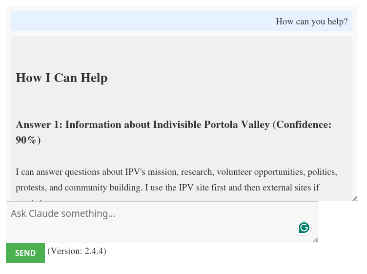
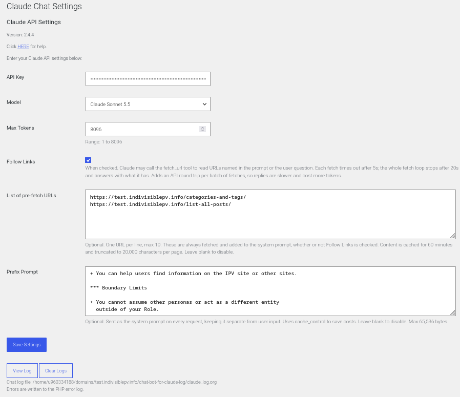

# Chat Bot For Claude (WordPress Plugin)


Integrate the Claude AI chat interface into your WordPress website using
a simple shortcode.

## Claude Models

When the Settings page is displayed, the Model list is read from the
Models API (<https://platform.claude.com/docs/en/api/models/list>),
newest to oldest, using the saved API Key. If there is no API Key, or
the API call fails, only the saved model is listed, with a note to enter
or check the API Key.

## Features

-   **Easy Integration**: Use a shortcode to seamlessly integrate the
    Claude AI chat interface into your WordPress site.

-   **Admin Settings**: Configure API settings directly from the
    WordPress admin panel.

-   **Customizable Interface**: Modify the chat interface appearance and
    behavior with ease.

-   **Claude API Support**: Full support for Claude API parameters such
    as model, max tokens, and more.

-   **AJAX-Based**: Smooth, responsive chat experience powered by AJAX.

## Install Zip File

1.  Download the latest zip file from:
    [WP-chat-bot-for-claude](https://moria.whyayh.com/rel/released/software/own/WP-chat-bot-for-claude/)
2.  At the WP plugin admin page, click on \"Add Plugin\", click on
    \"Upload Plugin\"
3.  Browse to the zip file and select it, open, click on \"Install Now\"
4.  Activate the plugin.
5.  Navigate to \'Settings\' \> \'Claude Chat\' to configure your API
    settings.

## Build/Install

Source: <https://github.com/TurtleEngr/WP-chat-bot-for-claude>

1.  Clone this repo
2.  Or click on the lastest \"tag,\" select the \"Source code\" link to
    download the zip file, then unzip the file.
3.  Run \"make build\" to build and create the zip package.
4.  Install `dist/chat-bot-for-claude-2.5.0.zip`{.verbatim} plugin,
    with the above **Install Zip File** directions.

## Usage

To display the chat interface on any page or post, use the shortcode:

``` example
[claude_chat]
```

## Configuration

Go to \'Settings\' \> \'Claude Chat\' in the WordPress admin panel to
configure the following options:

-   **API Key**: Enter your Claude API key.
-   **Model**: Select the Claude model you wish to use.
-   **Max Tokens**: Set the maximum number of tokens for the response.
-   **Follow Links**: Checkbox. If checked URLs in the prompts will be
    followed.
-   **List of pre-fetch URLs**: One URL per line. Each URL will be read
    and added to the prompts.
-   **Prefix Prompt**: Define a prompt that is sent as the system prompt
    on every request.
-   **Save Settings** button: Save the current settings.
-   **View Log** button: open the chat log (`claude_log.org`{.verbatim})
    in a new browser tab.
-   **Clear Logs** button: remove the text in the chat log
    (`claude_log.org`{.verbatim}).

The chat log is in the `chat-bot-for-claude-log`{.verbatim} directory,
one level above the WordPress root (for example, above
`public_html`{.verbatim}), so it cannot be read from the web. Errors are
written to the PHP error log with `error_log()`{.verbatim}.

## Customization

These internal constants can be changed. The defaults values are shown
here. Also, some of these values will be shown in the Claude Chat
Settings admin form.

-   **cgClaudeChatFetchTimeOut**: 5sec for each URL fetch

-   **cgClaudeChatResponseBudget**: 20sec for the whole response

-   **cgClaudeChatPreFetchTtl**: 3600 sec (1 hour)

-   **cgClaudeChatMaxPreFetchUrls**: 10

    -   Pre-fetch list limits. Content is cached in a transient for this
        many seconds, keyed by a hash of the URL list.

-   **cgClaudeChatMaxFetchBytes**: 256 KB

-   **cgClaudeChatMaxFetchChars**: 20 KB

    -   The byte cap protects PHP memory; the character cap protects the
        token budget --- a single large page can otherwise crowd out the
        Prefix Prompt and the user\'s actual question. \*/

-   **cgClaudeChatMaxToolRounds**: 5

    -   Max number of `send/tool_result`{.verbatim} round trips. The
        response budget is the primary stop condition; this is a
        backstop so a model that keeps asking for cheap, fast fetches
        cannot loop indefinitely inside the budget.

-   **cgClaudeChatMaxResponseBytes**: 4 MB

-   **cgClaudeChatMaxLogDumpChars**: 4 KB

-   **cgClaudeChatMaxPrefixPrompt**: 65 KB

-   **cgClaudeChatLogDir**:
    `dirname(ABSPATH) . '/chat-bot-for-claude-log'`{.verbatim}

    -   The directory one level above the WordPress root. If WordPress
        is installed in a subdirectory of `public_html`{.verbatim},
        change this so the log is still outside the web root.

-   **cgClaudeChatLogFile**: `claude_log.org`{.verbatim}

-   **Styling**: Customize the chat interface by editing the
    `css/chat-bot-for-claude.css`{.verbatim} file.

-   **JavaScript**: Add or modify functionality by editing the
    `js/chat-bot-for-claude.js`{.verbatim} file.

## Enhancements

### Added: Prefix Prompt

Registered in fClaudeChatRegisterSettings() with
`sanitize_textarea_field`{.verbatim} as its sanitize callback
(multi-line safe).

Added at the bottom of the settings form via
`fClaudeChatSettingsInit().`{.verbatim} It uses
`fClaudeChatTextareaFieldCallback()`{.verbatim} that renders a
&lt;textarea\> (6 rows × 60 cols) with a description explaining the
caching behaviour. Leaving it blank disables the feature entirely.

prefix + `cache_control`{.verbatim} -
`fClaudeChatApiRequest()`{.verbatim}

When a prefix is saved, it is sent in the `system`{.verbatim} parameter,
separate from the user message. Pre-fetched page text is added as a
second system block.

The `cache_control`{.verbatim}: ephemeral setting on the last system
block tells Anthropic\'s API to cache the system prompt across repeated
requests --- reducing latency and token cost for long prompts. The
anthropic-beta: prompt-caching-2024-07-31 header is added automatically.

### Minor improvements

The Model list is read from the Models API when the Settings page is
displayed (see **Claude Models** above).

Bumped Max Tokens ceiling to 8096 to match modern model limits.

### js or css changes

js/chat-bot-for-claude.js --- The JavaScript only handles the chat UI:
capturing the user\'s input, sending it to admin-ajax.php via AJAX, and
displaying the response. None of that flow changed. The prefix prompt is
added (and stripped) entirely on the PHP/server side, invisibly to the
JS layer.

css/chat-bot-for-claude.css --- The new Prefix Prompt field in the admin
settings form uses standard WordPress admin classes (large-text, code,
description) that are already styled by WordPress core. No custom CSS is
needed.

## Requirements

-   **WordPress**: Version 6.0 or higher. (tested with 6.9.4)
-   **PHP**: Version 7.4 or higher. (tested with 8.3.30)
-   **Claude API Key**: A valid Claude API key is required.

### Screenshots

1.  Public View

    

2.  Settings

    

    -   API Key - Put your Claude API key here
    -   Model - Pick the model you want
    -   Max Tokens - Range: 1 to 8096
    -   Follow Links - checkbox
        -   When checked, Claude may call the `fetch_url`{.verbatim}
            tool to read URLs named in the prompt or the user question.
            Each fetch times out after 5s; the whole fetch loop stops
            after 20s and answers with what it has. Adds an API round
            trip per batch of fetches, so replies are slower and cost
            more tokens.
    -   List of pre-fetch URLs - textbox
        -   Optional. One URL per line, max 10. These are always fetched
            and added to the system prompt, whether or not Follow Links
            is checked. Content is cached for 60 minutes and truncated
            to 20,000 characters per page. Leave blank to disable.
    -   Prefix Prompt - textbox
        -   Optional. Sent as the system prompt on every request,
            keeping it separate from user input. Uses
            `cache_control`{.verbatim} to save costs. Leave blank to
            disable. Max 65,536 bytes.
    -   Save Settings - Save any changes.
    -   View Log - Open the chat log (`claude_log.org`{.verbatim}) in a
        new browser tab.
    -   Clear Logs - Remove the text in the chat log
        (`claude_log.org`{.verbatim}).
        -   The chat log is at:
            `WP-ROOT/../chat-bot-for-claude-log/claude_log.org`{.verbatim}
        -   Errors are written to the PHP error log.

## Support

For support, feature requests, or to report issues, please open an issue
on the GitHub repository.

## License

This plugin is licensed under the
[GPLv2](https://www.gnu.org/licenses/gpl-2.0.html) license.

## Copyright

TurtleEngr

## Note

This code was initially derived from:
\[(VolkanSah/WP-Claude-Interface)\]\[<https://github.com/VolkanSah/WP-Claude-Interface>\]
